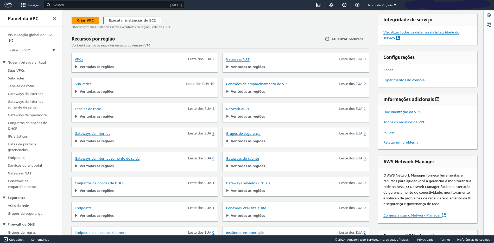

# projeto-redes

Esse repositório ensinará como implementar a seguinte infraestura na AWS


Primeiramente após você entrar no AWS você deve procurar o VPC e clicar para navegar até o VPC.

Depois você deve clicar, em criar VPC

Selecionar VPC e muito mais, atribuir um Bloco CIDR IPv4 a sua preferência

Deixar marcado as zonas de disponibilidades, numero de sub-redes públicas e privadas como 2, endpoints da vpc nenhuma.

Depois você irá retornar a área da vpc e clicar em grupos de segurança

Criar grupo de segurança

Você deve criar 2 grupos de segurança, 1 para proxy-reverso e outro para as instâncias privadas


Depois você deve navegar para o EC2

Clicar executar instância

Coloque um nome para as instancias, selecione imagem do Ubuntu

Seleciona o tipo de instância e caso você não tenha par de chave você deve criar e selecionar ele, depois clicar em editar de configurações de rede

Adiciona configurações de rede e selecionar grupo de rede de segurança existente, selecionar o grupo de segurança das instâncias privadas
 
Configurar armazenamento de uns 20gb e depois de executar intância
 
Depois você irá renomear as instância, um para o banco de dados e o restante para o backend, você deve anotar os ip privados das instâncias do backend e do banco de dados

A seguir você deve voltar ao grupos de segurança para editar as regras de entrada do grupo da instâncias privadas

Adicionando as regras para as instancias do backend poderem acessar o mysql, escolhendo o tipo para mysql/aurora, e passando o ip privado da instância como demonstrado na imagem

Depois você irá novamente no ec2 e criará a instância do proxy reverso

Colocando as mesmas configurações de rede das instâncias privadas, somente alterando o grupo de segurança para o do proxy reverso

Configurando 10gb de armazenamento e executando as instâncias


Agora você irá copiar também o ip privado do proxy reverso e deixar ele guardado para facilitar para o restante das configurações

Assim você deve retornar para os grupo de segurança uma ultima vez para ultima alteração necessária no grupo de segurança das instâncias privadas

Você deve adicionar uma última regra, com a porta 8000, passando o ip privado da instância proxy reverso

Depois você irá voltar nas instância e irá clicar na instância e clicar conectar

Para facilitar você usará a conexão de instância do EC2

Você terá um terminal assim e seguirá o seguintes passos


## Banco de dados
```bash
#Aqui Atualiza os repositórios do git
sudo apt update
#Aqui você verifica se o git estiver instalado
git --version
#Caso não esteja você utilize o comando abaixo
sudo apt install git -y
#depois você irá clonar esse repositório
git clone https://github.com/KhovetS2/projeto-redes.git
# entrar na pasta do repositório
cd projeto-redes/
# liberar a execução do script para instalação do docker
chmod +x script-docker.sh
# Executar o script do docker para instalação
./script-docker.sh
# você entra dentro da pasta do db
cd db/
# e utiliza o comando abaixo para subir o container do banco de dados
sudo docker compose up -d
```

Depois você irá conectar nas instâncias e seguir os seguintes comandos para configurar


## Backend

```bash
#Aqui Atualiza os repositórios do git
sudo apt update
#Aqui você verifica se o git estiver instalado
git --version
#Caso não esteja você utilize o comando abaixo
sudo apt install git -y
#depois você irá clonar esse repositório
git clone https://github.com/KhovetS2/projeto-redes.git
# entrar na pasta do repositório
cd projeto-redes/
# liberar a execução do script para instalação do docker
chmod +x script-docker.sh
# Executar o script do docker para instalação
./script-docker.sh
# você vai alterar no config.py o ip do banco no @ para o ip privado do banco de dados
vim backend/config.py
# você vai alterar no conection.py o ip do banco no host para o ip privado do banco de dados
vim backend/app/controllers/conection.py
# depois você executara esse comando que o backend era começar a funcionar
sudo docker compose up -d
```

Por fim você irá configurar o proxy reverso e load balance

## Proxy reverso e Load Balance

```bash
#Aqui Atualiza os repositórios do git
sudo apt update
# aqui você irá instalar o nginx para fazer o load balance e o proxy reverso
sudo apt install nginx - y
#Aqui você verifica se o git estiver instalado
git --version
#Caso não esteja você utilize o comando abaixo
sudo apt install git -y
#depois você irá clonar esse repositório
git clone https://github.com/KhovetS2/projeto-redes.git
# irá alterar o upstream para colocar os ips privados das instancias de backend
vim proxy/loadbalance.conf
# depois você irá copiar o arquivo do loadbalance para o ngnix
sudo cp proxy/loadbalance.conf /etc/nginx/conf.d/
# você irá remover a configuração default do nginx
sudo rm /etc/nginx/sites-available/default 
# irá copiar a configuração do nginx dispónivel no repositório
sudo cp proxy/default /etc/nginx/sites-available/
# testar se está tudo correto
sudo nginx -t
# e atualizar o nginx fazendo tudo funcionar 
sudo nginx -s reload
```

Após isso, você pode pegar o ip público da maquina do proxy reverso e acessar que irá ver a aplicação funcionando